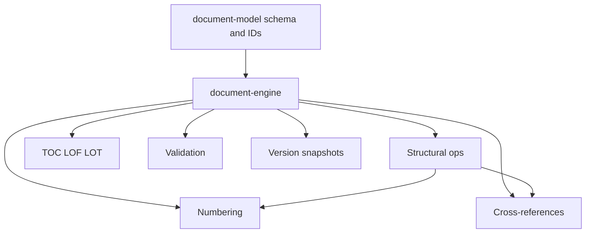
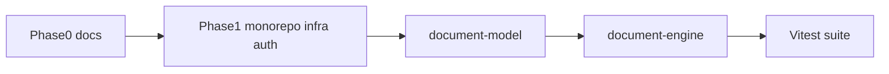

# Delayance — Plan Through Phase 2

Scope stops after the document engine is reliable. Later work (API document CRUD UI, Tiptap, DOCX, AI, sources) is out of scope for this plan.

**Source of truth:** [`Delaynce requirements.md`](/home/danny/Documents/Vault%201/Delaynce%20requirements.md) (copy into repo in Phase 0). Product priority §43: reliable document structure before AI or Word features.

**Repo state:** empty greenfield except [`.cursor/settings.json`](.cursor/settings.json).

---

## Out of scope (after Phase 2)

- Tiptap / workspace UI beyond a minimal Next.js shell
- DOCX import/export, PDF, MinIO usage in product flows
- AI providers and proposed-ops pipeline
- Sources, comments UI, real-time collaboration
- Full project memory product UI (DB tables for projects/members may exist for auth scaffolding only)

---

## Phase 0 — Requirements and architecture docs

**Goal:** In-repo truth and explicit assumptions before code.

| Deliverable | Path |
| --- | --- |
| Copy vault requirements | [`docs/REQUIREMENTS.md`](docs/REQUIREMENTS.md) |
| Architecture (modular monolith, package boundaries, AI safety rule) | [`docs/ARCHITECTURE.md`](docs/ARCHITECTURE.md) |
| Staged limits and Phase 0–2 decisions | [`docs/ASSUMPTIONS.md`](docs/ASSUMPTIONS.md) |
| Local setup stub (filled in Phase 1) | [`docs/SETUP.md`](docs/SETUP.md) |

**Assumptions to record now:**

- Product name: **Delayance**
- ORM: **Drizzle** + PostgreSQL JSONB
- Auth: email/password + JWT (access/refresh) for foundation only
- `apps/collaboration`: directory placeholder only
- Document packages must run as pure TypeScript libraries (no Nest/React imports)

**Exit:** Docs exist; no application logic yet.

---

## Phase 1 — Monorepo and platform foundation

**Goal:** Typed monorepo + Docker infra + runnable empty apps + auth/DB skeleton so Phase 2 packages can be developed and tested in-repo.

### 1.1 Workspace layout

```text
apps/
  web/              Next.js App Router shell (health page only)
  api/              NestJS REST bootstrap
  worker/           BullMQ worker bootstrap (ping job only)
  collaboration/    README placeholder (no Yjs)

packages/
  typescript-config/
  eslint-config/
  shared-types/     empty or minimal IDs/errors
  validation/       Zod env + shared primitives
  document-model/   created empty in Phase 1; implemented in Phase 2
  document-engine/  created empty in Phase 1; implemented in Phase 2
  design-system/    CSS variable tokens stub (optional thin)

infra/
  docker-compose.yml
  docker/           Postgres+pgvector, Redis, MinIO images/config
```

Tooling: **pnpm** workspaces, **Turborepo** pipelines (`build`, `dev`, `lint`, `test`, `typecheck`), shared ESLint/Prettier, **Vitest**.

### 1.2 Docker Compose

Services:

- PostgreSQL with **pgvector** extension enabled
- Redis (BullMQ)
- MinIO (S3-compatible; unused by product flows until later phases, but up for env parity)

Include a one-shot or documented migration path for creating the `vector` extension.

### 1.3 Apps (minimal but real)

**`apps/api` (NestJS)**

- Config module with Zod-validated env (`DATABASE_URL`, `REDIS_URL`, `JWT_*`, `MINIO_*`, etc.)
- Global exception filter + consistent error shape
- Health: `/health` (process), `/health/ready` (DB + Redis)
- Swagger/OpenAPI at `/docs`
- Auth module: register, login, refresh, logout; password hashing (argon2 or bcrypt)
- Drizzle client module; migrations for:
  - `users`
  - `sessions` / refresh tokens
  - `projects`
  - `project_members` (roles: owner, editor, contributor, reviewer, viewer)
  - `audit_events` (append-only basics)
- Rate limiting on auth routes
- Encrypted-at-rest helper for future AI API keys (library + unit test; no UI yet)

**`apps/web` (Next.js)**

- Tailwind + shadcn/ui bootstrap
- Minimal pages: home, login/register wired to API (proves auth end-to-end)
- No document editor

**`apps/worker`**

- BullMQ connection; `health.ping` queue consumer
- API can enqueue ping; worker logs success (proves job path)

### 1.4 Root DX

- `.env.example` documenting all variables
- `pnpm dev` via Turbo starts api + web + worker (Compose assumed running)
- Root README: clone → Compose up → migrate → `pnpm install` → `pnpm dev`

**Phase 1 exit criteria**

- Compose healthy; migrations apply
- Register → login → authenticated `/me` (or equivalent)
- OpenAPI reachable
- Worker processes a ping job
- `pnpm test` / `pnpm typecheck` / `pnpm lint` succeed for the scaffold

---

## Phase 2 — Canonical document model and engine

**Goal:** Deterministic document core that later phases must use. Aligns with requirements §§9–14, §27 (version snapshots in-package), §43 priorities 1–2. **No AI. No DOCX. No DB persistence of documents yet** (in-memory / fixture-based engine API is enough; version helpers are pure functions over model JSON).



### 2.1 `packages/document-model`

**Document root**

- `Document` with `id`, `title`, `templateRef` / embedded `DocumentTemplate`, `children` (ordered block/section tree), optional front-matter flags

**Node kinds (each important node has stable `id: string`)**

- `section`, `heading`, `paragraph`, `figure`, `table`, `caption`, `list` / `listItem`, `quote`, `equation`, `citation`, `footnote`, `pageBreak`, `sectionBreak`, `appendix`, `crossReference`
- Inline marks: bold, italic, underline, link (typed, not free HTML)
- Tables: rows/cells with header-row flag
- Figures: media ref placeholder (`assetId` string; no MinIO wiring yet)
- Cross-references: `{ targetId, type, displayMode }` — **never** store visible numbers as source of truth

**Template schema (numbering + style policy)**

- Page: size, margins, orientation (data only)
- Typography: body/heading fonts and sizes (data only)
- Numbering: `global` | `byChapter`; formats for headings, figures (`Figure 3.2`), tables, equations, appendices (`Appendix A`), footnotes
- Caption position/format preferences

**ID rules**

- Generate stable IDs on create (ULID or UUID)
- Move/reorder **must not** change IDs
- Provide `assertStableIds` / clone helpers for tests

**Validation of schema:** Zod (in model or `packages/validation`) so API can reuse later.

### 2.2 `packages/document-engine`

Pure functions / small service class: `(doc, op) => Result`.

#### Structural operations (req §10)

Implement and test first:

- Insert node / section (before/after/into)
- Replace content at id
- Delete node (with preflight)
- Move section (with all descendants)
- Promote / demote heading (level change + tree fix-up)

Defer if needed (document in ASSUMPTIONS): split section, merge sections, move section across documents.

#### Numbering engine (req §11)

- Compute visible labels from structure + template
- Cache-friendly API: `computeNumbering(doc) => NumberingMap` keyed by node id
- After every structural op, numbering is recomputed from structure (not stored as authoritative)

#### Cross-references (req §12)

- Resolve display text from `NumberingMap` + target type
- `findBrokenReferences(doc)`
- `getIncomingReferences(doc, targetId)`
- Delete preflight: warn/error when target is referenced (`DeletionWarning`)

#### Generated lists (req §13)

- Build in-model TOC / list-of-figures / list-of-tables entries from structure (entries point at target ids)
- No Word fields yet (Phase 5); this is the canonical list data

#### Validation (req §24-ish deterministic subset)

- Invalid heading level jumps
- Empty sections
- Manual-numbering heuristics (paragraphs matching `/^\d+(\.\d+)*\s+/` or “Figure 1:” patterns) → warnings
- Duplicate ids
- Orphan captions / missing caption on figure-table (warning)

#### Version snapshots (req §27, in-package)

- `createSnapshot(doc, meta) => VersionSnapshot` (deep freeze / clone of JSON)
- `restoreDocument(snapshot) => Document`
- `restoreSection(currentDoc, snapshot, sectionId) => Document`
- Diff helper optional; not required for Phase 2 exit

**Do not** implement AI op application here beyond a typed `DocumentOperation` union that later AI will emit; engine applies only validated ops.

### 2.3 Mandatory tests (Vitest)

| Area | Cases |
| --- | --- |
| Stable IDs | Move section; promote/demote; IDs unchanged |
| Heading numbering | Nested headings; by-chapter vs global |
| Figure/table numbering | Insert/move/delete updates labels |
| Section move | Descendants move; numbering + xrefs update |
| Promote/demote | Level + parentage correct |
| Cross-refs | Display updates after move; broken detection |
| Deletion | Warning when referenced; apply delete breaks xref detection |
| Validation | Bad hierarchy; duplicate id rejected |
| Versions | Snapshot → mutate → restore full doc; restore one section |

Golden fixtures under `packages/document-engine/fixtures/` for a small multi-chapter sample.

### 2.4 Package public API sketch

```ts
// document-model
export type Document, DocNode, DocumentTemplate, CrossReferenceNode, ...
export function createEmptyDocument(...): Document
export function generateNodeId(): string

// document-engine
export function applyOperation(doc: Document, op: DocumentOperation): ApplyResult
export function computeNumbering(doc: Document): NumberingMap
export function resolveCrossReferences(doc: Document, map: NumberingMap): ResolvedRef[]
export function validateDocument(doc: Document): ValidationIssue[]
export function createSnapshot(...): VersionSnapshot
export function restoreDocument(...): Document
```

Apps may depend on these packages in Phase 1/2 for compile wiring, but **no Nest controllers for documents yet**.

**Phase 2 exit criteria**

- All mandatory tests green
- Packages export typed API; zero dependency on Nest, React, Tiptap, or OOXML
- `docs/ASSUMPTIONS.md` lists deferred ops (split/merge/cross-doc move) if not done
- README section: how to run document-engine tests

---

## Dependency order and risk



| Risk | Mitigation |
| --- | --- |
| HTML/Markdown creep as source of truth | Model is JSON nodes only; no HTML field as canonical |
| Over-building template/page layout | Template is data schema only in Phase 2 |
| Spending time on Nest document routes | Explicitly deferred to Phase 3 |
| Unstable IDs on tree rewrite | Ops must reuse node objects/ids; tests enforce |

---

## Definition of done (this plan)

1. Docs REQUIREMENTS / ARCHITECTURE / ASSUMPTIONS / SETUP in repo  
2. Monorepo + Compose + api/web/worker health + auth + migrations  
3. `document-model` + `document-engine` implemented with mandatory tests  
4. No claim of editor, DOCX, or AI completeness  

**Hand-off to next plan (Phase 3+):** persist `Document` JSONB via API, build workspace shell, then bind Tiptap through `editor-schema`.
