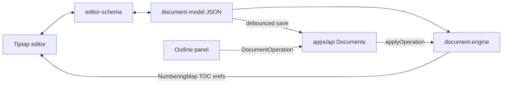

# Delayance — Plan for Phases 3 and 4

Builds on completed Phases 0–2. Source of truth: [`docs/REQUIREMENTS.md`](docs/REQUIREMENTS.md) §§7–10, §28, §32–33, §40. Master roadmap: [`.cursor/plans/delayance_phased_build_1d95ef77.plan.md`](.cursor/plans/delayance_phased_build_1d95ef77.plan.md).

**Reuse as-is:** JWT auth, `projects` / `project_members` tables, `@delayance/document-model`, `@delayance/document-engine`, design-system theme tokens.

**Out of scope:** DOCX/PDF, AI providers, sources product flows, real-time Yjs, split/merge section ops.

---

## Current baseline

- API has auth/health/jobs only; projects tables exist with **no CRUD or RBAC guards**
- Web: `/`, `/login`, `/register`, `/account` only
- Document engine is pure and tested; **not wired to API**
- Themes: CSS tokens for light/dark/sepia/high-contrast; `system` typed but unwired

---

## Phase 3 — Persistence API and workspace shell

**Goal:** Create project → create document → load/save JSONB with RBAC; three-panel shell; theme switching. Editor center can be a read-only structured preview until Phase 4.

### 3.1 Database (Drizzle migration)

Extend [`apps/api/src/database/schema.ts`](apps/api/src/database/schema.ts):

| Table | Purpose |
| --- | --- |
| `document_templates` | Named templates; `definition jsonb` using `DocumentTemplate` shape; seed one default |
| `documents` | `project_id`, `title`, `template_id`, `content jsonb` (`Document`), `status`, timestamps |
| `document_versions` | `document_id`, `snapshot jsonb`, `name`, `reason`, `created_by`, `created_at` |
| `project_memory_items` | `project_id`, `kind` enum (`instruction` \| `fact` \| `decision` \| `open_question`), `body`, `sort_order` |
| `comments` | `document_id`, `anchor_node_id`, `author_id`, `body`, `resolved_at`, `parent_id` (replies) |
| `section_assignments` | `document_id`, `section_id`, `assignee_id`, `status` enum (`not_started` \| `notes` \| `draft` \| `needs_review` \| `approved` \| `locked`) |
| `stored_objects` | MinIO key metadata only (uploads not required for Phase 3 product flows) |

On document create: `createEmptyDocument(title)` from document-model; store full JSON in `content`. On meaningful saves: call engine `createSnapshot` and insert `document_versions` (keep last N or all with pagination later).

### 3.2 RBAC

- Nest guard/decorator: resolve membership from `project_members`; roles from [`packages/shared-types`](packages/shared-types) (`owner` \| `editor` \| `contributor` \| `reviewer` \| `viewer`)
- Rules: Owner full; Editor mutate content/memory; Contributor edit assigned unlocked sections only (enforce when section assignment exists; otherwise treat as editor-lite for own creates); Reviewer comments + read; Viewer read-only
- Project create auto-adds creator as `owner`
- All project-scoped routes check membership; audit key mutations into `audit_events`

### 3.3 API modules

Wire `@delayance/document-model` + `@delayance/document-engine` into Nest:

| Module | Endpoints (sketch) |
| --- | --- |
| Projects | CRUD list/create/get/update/delete |
| Members | list/add/update role/remove |
| Memory | list/create/update/delete by kind |
| Templates | list + get default; seed on migrate/bootstrap |
| Documents | create/list/get; `PATCH` content (full replace of validated `Document` JSON); apply single `DocumentOperation` via `applyOperation` then persist |
| Versions | list (paginated), get, restore full document |
| Comments | list by document; create/reply/resolve |
| Assignments | list/upsert section status + assignee; lock flag mirrored into section node `locked` in content when status is `locked` |

Validate incoming document JSON with `documentSchema`. Reject ops that target locked sections unless forced by owner.

### 3.4 Web shell (req §7, §32–33)

Routes:

- `/projects` — project list + create
- `/projects/[projectId]` — project hub (docs list, memory settings)
- `/projects/[projectId]/documents/[documentId]` — **workspace**

Workspace layout (flat panels, thin separators, no card-heavy chrome):

```text
[ Left: collapsible ]     [ Center ]              [ Right: collapsible ]
  Documents                 Document title            Outline (structure tree)
  Sources (placeholder)     Phase 3: JSON/tree        Comments
  Memory                    preview of headings       Review (placeholder)
  AI (placeholder)          + save status             Layout / section props stub
  History stub
```

State: **Zustand** store for panel collapse, active document id, theme.

Themes: light / dark / system / sepia / high-contrast. Implement `system` via `prefers-color-scheme`. Keep `--dl-doc-page` white (or template-driven later) while app chrome follows theme.

Auth: keep token in `localStorage` for now; add simple API client helper with bearer + refresh.

**Phase 3 exit:** Authenticated user creates project and document; loads/saves content JSON through API with role checks; switches themes; workspace panels collapse; Swagger documents new routes; integration tests for RBAC + document save.

---

## Phase 4 — Tiptap editor bound to document model

**Goal:** Writing surface whose source of truth remains canonical JSON. Numbering and xrefs come from document-engine, not from the editor or AI.



### 4.1 `packages/editor-schema`

New package: bidirectional conversion

- `documentToPmJson(doc: Document) => ProseMirror JSON`
- `pmJsonToDocument(pm, meta) => Document` (preserve stable IDs on nodes via attrs)
- Custom node attrs always include `id`
- Round-trip Vitest fixtures (multi-chapter sample from document-engine)

Map: section, heading levels, paragraph, lists, tables (+ caption), figures (+ caption), quotes, code/quote as available, page/section break, crossReference, footnote marker, equation (latex attr), citation stub.

### 4.2 Web editor integration

Dependencies in [`apps/web`](apps/web): `@tiptap/react`, starter kit pieces, table extension, placeholder; **Zustand** for editor UI state.

Center panel:

- Continuous mode (default): flowing canvas on `--dl-doc-page`
- Basic print layout mode: fixed page width from template margins, show page/section break markers (not pixel-perfect Word)
- Toolbar: marks, heading levels, insert figure/table/xref/page break (minimal)
- Keyboard shortcuts + **command palette** (cmdk or lightweight custom) for common actions
- Selection-based editing only mutates PM doc; on transaction end, convert to `Document` and recompute `computeNumbering` / `resolveCrossReferences` for display decorations
- **Debounced autosave** (~1.5s) of full `Document` JSON to `PATCH /documents/:id`; show dirty/saving/saved; avoid per-keystroke API calls
- Version snapshot: API already snapshots on save thresholds (e.g. every N saves or explicit “Save version”)

### 4.3 Outline panel (req §10)

Right or left outline driven by document tree + numbering labels:

- Move section up/down / nest (calls `moveSection` via API or local apply + save)
- Promote/demote heading
- Insert section before/after
- Delete with engine deletion warnings surfaced in UI
- Lock section (assignment status / `locked` flag) — disable edits in locked regions in the editor

### 4.4 Comments (req §28 subset)

- Create comment on selected node id; list in right panel; resolve
- No full suggested-changes track yet

### 4.5 Tests

- Unit: editor-schema round trips; ID stability across convert
- Integration: document op + save + reload
- Smoke: outline move updates numbering labels in UI (component or engine-level assertion after apply)

**Phase 4 exit:** User writes in Tiptap, rearranges via outline, sees numbering/xref labels update from engine, autosave persists, comments attach to node IDs, continuous and basic print modes work.

---

## Implementation order

1. Migration + RBAC helper + Projects/Members/Memory/Templates APIs  
2. Documents + Versions + Comments + Assignments APIs + seed template  
3. Web project list + project hub + workspace chrome + themes  
4. `editor-schema` package + round-trip tests  
5. Tiptap center editor + autosave + numbering decorations  
6. Outline ops + comments UI + print/continuous toggle + command palette  

---

## Concrete defaults

| Topic | Choice |
| --- | --- |
| Content persistence | Full-document JSONB replace (not CRDT); ops endpoint for structural changes |
| Autosave | Debounce 1.5s; batch; snapshot row every save for Phase 3/4 simplicity (paginate list) |
| Contributor RBAC | Enforce locked sections; unrestricted section assignment UI is basic upsert |
| shadcn | Add only primitives needed (Button, Dialog, Dropdown, Separator, ScrollArea) — flat styling |
| Sources / AI panels | Visible placeholders with “Coming later” copy — no fake data in API paths |
| Media | Figure `assetId` remains string placeholder; no upload UI in Phase 4 |

---

## Risks and mitigations

| Risk | Mitigation |
| --- | --- |
| PM ↔ model drift loses IDs | Attr-based ids; round-trip tests; never regenerate ids on serialize |
| Saving entire doc on every keystroke | Debounce + dirty flag; structural ops via explicit apply |
| HTML becoming source of truth | Persist only `Document` JSON from converter; never store `editor.getHTML()` |
| Workspace UI clutter | Follow req §32: flat panels, thin rules, compact controls |

---

## Definition of done

1. Projects, memory, documents, versions, comments, assignments APIs with RBAC  
2. Workspace shell with collapsible panels and five themes including system  
3. `editor-schema` round-trips with stable IDs  
4. Tiptap editor + outline ops + engine numbering in UI + debounced autosave  
5. No DOCX/AI claimed complete; placeholders clearly labeled  
6. Tests green for RBAC, persistence, schema round-trip, and engine-backed outline moves  
