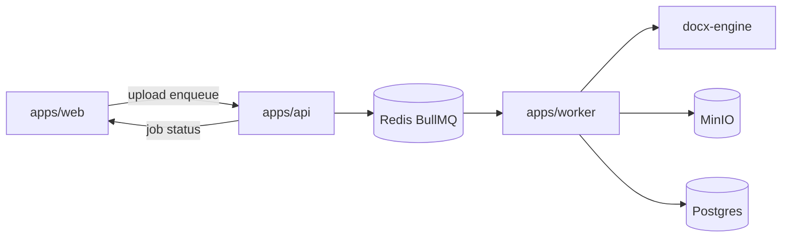
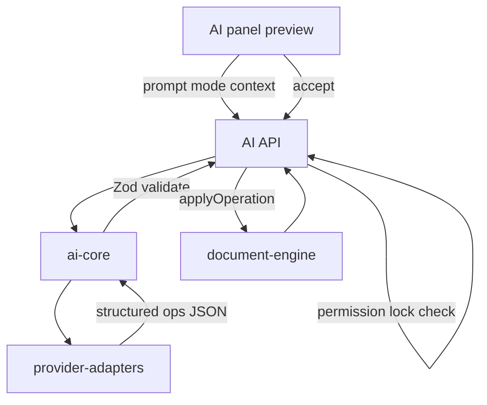

# Delayance — Plan for Phases 5 and 6

Builds on Phases 0–4 (document model/engine, persistence, Tiptap workspace). Source of truth: [`docs/REQUIREMENTS.md`](docs/REQUIREMENTS.md) §§15–17, §§19–24, §39–41. Master roadmap: [`.cursor/plans/delayance_phased_build_1d95ef77.plan.md`](.cursor/plans/delayance_phased_build_1d95ef77.plan.md).

**Reuse:** `document-model` / `document-engine` / `editor-schema`, Documents API (`content` + `operations`), MinIO env + `stored_objects` table, BullMQ worker scaffold, AES helper for secrets.

**Out of scope:** Full Agent/Research/Interview/Transform modes; perfect Word round-trip (SmartArt/macros/embedded Excel); source library/embeddings (Phase 7); real-time collab.

---

## Baseline gaps

- No `packages/docx-engine`, `ai-core`, or `provider-adapters`
- Worker only handles `health.ping`; MinIO unused at runtime
- No import/export/PDF/AI API or UI beyond placeholders

---

## Phase 5 — DOCX import, normalize, export, PDF

**Goal:** Contributor DOCX → preview + compatibility report → apply into canonical JSON; export real OOXML with Word fields; PDF via Playwright. Heavy work runs in [`apps/worker`](apps/worker).

### 5.1 `packages/docx-engine`

Pure library (no Nest/React):

**Import**

- Unpack DOCX (ZIP); parse `word/document.xml`, `styles.xml`, `numbering.xml`, media
- Use **JSZip + fast-xml-parser** for OOXML; **Mammoth** as assist for plain paragraphs/tables where useful
- Map to `Document` / `DocNode` with new stable IDs
- Modes: `preserve` | `normalize` (default for contributors)
- Normalize: map styles → project `DocumentTemplate`; strip source fonts/spacing when requested; detect manual numbering/captions; optional remove headers/footers/TOC/page settings
- Output: `{ document, styleMap, compatibilityReport, extractedMedia[] }`

**Export**

- Build OOXML package from `Document` + template
- Real structures: heading/paragraph/character styles, multilevel numbering, bookmarks, caption styles, TOC / page-number / cross-ref **fields**, headers/footers, section props, repeating table header rows, keep-with-next where applicable
- Pre-export compatibility report via engine validators + unsupported-feature scan

**Cleanup**

- `previewNormalize(doc)` / `applyNormalize(doc, options)` wrapping `validateDocument` heuristics (manual numbering, bad heading jumps, missing captions)

**Tests (mandatory):** open generated ZIP; assert `word/document.xml`, `styles.xml`, `numbering.xml`, and field instructions (`w:fldChar` / `instrText` for TOC/PAGE/REF). Fixture corpus: at least one Word-like and one LibreOffice-like DOCX under `packages/docx-engine/fixtures/`.

### 5.2 Object storage + jobs

- Add `@aws-sdk/client-s3` (or `minio` SDK) service in API/worker using existing `MINIO_*` env
- Wire `stored_objects` on upload/export
- New BullMQ queues: `docx.import`, `docx.export`, `pdf.export`, `document.cleanup`
- Tables (migration):
  - `jobs` — id, type, project_id, document_id, status, progress, result jsonb, error, created_by, timestamps
  - `document_exports` — document_id, format (`docx`|`pdf`), stored_object_id, compatibility_report jsonb, created_by
  - `document_imports` — project_id, document_id nullable, source_object_id, mode, style_map jsonb, report jsonb, preview_content jsonb, status
- API enqueues only; worker writes results; poll `GET /jobs/:id` (WebSocket status deferred — REST polling is enough for Phase 5)

### 5.3 API modules

| Area | Endpoints |
| --- | --- |
| Upload | `POST /projects/:projectId/files` multipart → MinIO + `stored_objects` |
| Import | `POST .../documents/import` (fileId, mode, options) → job; `GET .../imports/:id` preview; `POST .../imports/:id/apply` merges preview into new or existing doc via validated JSON |
| Export | `POST .../documents/:id/export` `{ format: docx\|pdf }` → job; download via signed/presigned URL or proxy |
| Cleanup | `POST .../documents/:id/cleanup/preview` (sync OK for small); `POST .../cleanup/apply` |
| Jobs | `GET /jobs/:id` |

RBAC: contributor+ import/export; viewer can download exports of accessible docs.

### 5.4 Worker + Compose

- Extend [`apps/worker`](apps/worker) with queue consumers calling docx-engine + Playwright PDF
- PDF path: serialize print-layout HTML from document-model (simple template, reuse template page size/margins) → Playwright Chromium → PDF → MinIO
- Docker Compose: add Playwright deps in worker image; add **LibreOffice** service or sidecar for optional conversion checks (document in SETUP; not required on happy path)

### 5.5 Web UI

- Import wizard: upload → mode (normalize recommended) → style mapping editor → compatibility report → apply
- Export dialog: DOCX/PDF + show report summary + download when job completes
- Normalize Document tool in right panel (preview issues → apply)
- Poll job status with compact progress; no fake success without backend

**Phase 5 exit:** Import preview → apply; DOCX export passes OOXML field tests; PDF job stores file; cleanup preview/apply works; LibreOffice noted for optional checks.

---

## Phase 6 — AI layer (after DOCX reliability)

**Goal:** Ask / Edit / Write / Review with structured ops only — never direct DB writes from providers (req §16).

### 6.1 Packages

**`packages/ai-core`**

- Provider interface: `complete`, `stream`, `completeStructured`
- Prompt builders per mode; context packer (project memory + selection/section nodes + numbering labels) — **section-scoped by default**
- Zod schemas for proposed ops (align with `DocumentOperation` + review findings + comment inserts)
- `validateAiProposal(ops, doc, role)` → reject malformed / locked / unauthorized

**`packages/provider-adapters`**

- `OpenAIAdapter`, `OllamaAdapter`, `OpenAICompatibleAdapter`
- Thin stubs: Anthropic, Gemini, OpenRouter (same interface; implement if low cost, else stub with clear “not configured”)
- No provider logic outside this package

### 6.2 Persistence and security

- Tables: `ai_provider_configs` (project scoped; **encrypted** API keys via existing secrets helper); `ai_sessions` / `ai_messages`; `ai_proposals` (ops jsonb, status pending/accepted/rejected, model, prompt summary, context node ids)
- Project setting: `aiPolicy: 'any' | 'local_only'` (Ollama / compatible local base URL only)
- Banner when external provider would receive content; block external when `local_only`

### 6.3 API

| Endpoint | Behavior |
| --- | --- |
| `GET/PUT .../projects/:id/ai-settings` | provider/model/policy |
| `POST .../documents/:id/ai/ask` | stream or JSON answer; no ops |
| `POST .../documents/:id/ai/edit` | selection + instruction → proposal |
| `POST .../documents/:id/ai/write` | location + instruction → insert proposal |
| `POST .../documents/:id/ai/review` | scope → findings (map to comment creates / markers) |
| `GET .../ai/proposals/:id` | proposal detail |
| `POST .../ai/proposals/:id/accept` | permission + lock → `applyOperation` / comments → version + history |
| `POST .../ai/proposals/:id/reject` | record rejection |

Streaming: SSE from API for Ask/Edit tokens; final message includes structured ops when applicable.

### 6.4 Web UI

- Left AI tab: mode selector (Ask/Edit/Write/Review), model indicator, external-send warning
- Edit/Write: side-by-side or inline diff preview; Accept / Reject / Edit manually
- Review: findings list linking to node ids (right panel)
- AI history list from `ai_proposals`

### 6.5 Tests

- Zod rejects bad ops; locked section reject; viewer cannot accept; accept applies via engine and creates version
- Adapter unit tests with mocked HTTP
- No production path with mock document data

**Phase 6 exit:** Ask/Edit/Write/Review work with OpenAI **or** Ollama; accept/reject path only through document-engine; external-send disclosure + local-only policy enforced.

---

## Implementation order

1. Object storage client + `jobs` / import / export tables
2. `docx-engine` import + compatibility + tests with fixtures
3. Worker import/export queues + API enqueue/status + apply import
4. DOCX export OOXML fields + PDF Playwright pipeline + UI wizards
5. Document cleanup tool
6. `ai-core` + adapters + encrypted settings
7. AI API proposal pipeline + streaming Ask
8. AI panel UI accept/reject + history + policy banner

---

## Concrete defaults

| Topic | Choice |
| --- | --- |
| Job status | REST polling every 1–2s (no WS in this phase) |
| Import default mode | Normalize to project template |
| PDF | Playwright HTML print layout (not LibreOffice primary) |
| AI structured output | JSON schema / Zod parse; retry once on parse failure then fail clearly |
| Primary providers for exit | OpenAI + Ollama + OpenAI-compatible |
| Agent/Research/Interview/Transform | Deferred (req §41); UI does not claim them complete |

---

## Risks

| Risk | Mitigation |
| --- | --- |
| OOXML fidelity | Field-based TOC/PAGE/REF; compatibility reports; ZIP assertion tests |
| Multi-origin DOCX | Normalize default; fixture corpus; report converted/unsupported |
| AI hallucinated ops | Strict Zod; never auto-apply; engine apply only |
| Sending full docs to AI | Section/selection context packer enforced in ai-core |
| Long-running export blocking API | BullMQ only; API returns job id |

---

## Definition of done

1. DOCX import preview/apply with normalize + compatibility report
2. DOCX export with real styles/numbering/bookmarks/fields; OOXML tests pass
3. PDF export job + download; cleanup preview/apply
4. AI Ask/Edit/Write/Review with proposal accept/reject via document-engine
5. OpenAI or Ollama end-to-end; local-only policy + external disclosure
6. Limitations documented (equation OMML gaps, deferred Agent mode, etc.)
