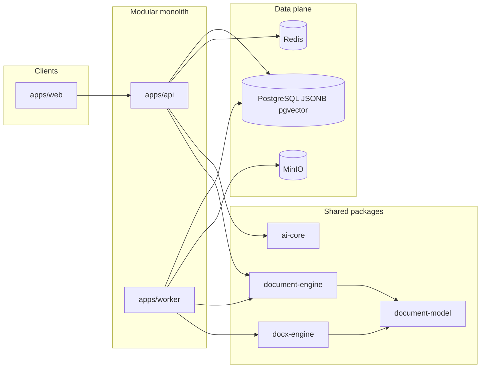

# Delayance — Phased Implementation Plan

## Current state

- Workspace [`/home/danny/Documents/workspace/delayance`](/home/danny/Documents/workspace/delayance) is empty except [`.cursor/settings.json`](.cursor/settings.json).
- Source of truth: [`/home/danny/Documents/Vault 1/Delaynce requirements.md`](/home/danny/Documents/Vault%201/Delaynce%20requirements.md) (sections 40–43 define v1 scope, deferred work, and build priority).
- No reusable application code exists. Everything is greenfield.

## Assumptions (documented)

| Topic | Choice | Why |
| --- | --- | --- |
| Product name / repo | **Delayance** | Matches workspace; requirements title is “AI Document Workspace” |
| Requirements in-repo | Copy vault doc → [`docs/REQUIREMENTS.md`](docs/REQUIREMENTS.md) | Matches process Step 1; single in-repo source of truth |
| Auth (v1) | Email/password + JWT (access + refresh), project RBAC | Simplest path that supports Owner/Editor/Contributor/Reviewer/Viewer |
| Collaboration app | Scaffold [`apps/collaboration`](apps/collaboration) only; **no Yjs real-time in v1** | Explicitly deferred (req §28, §41) |
| AI modes (v1) | Ask, Edit, Write, Review fully; Agent/Research/Interview/Transform as thin stubs or deferred | Req §40 lists Ask–Review; advanced modes in §41 |
| AI providers (v1) | OpenAI, Ollama, OpenAI-compatible; Anthropic/Gemini/OpenRouter as thin adapters behind same interface | Same interface cost is low; OpenAI-compatible covers many hosts |
| Equations (v1) | Model + KaTeX render; DOCX as OMML where practical, else converted/flagged in compatibility report | Full Word equation fidelity is staged |
| PDF (v1) | Playwright HTML→PDF from print layout | LibreOffice kept as fallback conversion utility in Docker |
| Storage | MinIO via S3 API | Matches stack |

---

## Target architecture

```text
apps/
  web/             Next.js editor + project UI
  api/             NestJS REST (+ WS for job/AI stream status)
  worker/          BullMQ consumers (import/export/PDF/embeddings)
  collaboration/   scaffold only (Yjs later)

packages/
  document-model/  canonical schema, stable IDs, JSON types
  document-engine/ numbering, xref, TOC, ops, versions, validation
  editor-schema/   Tiptap/ProseMirror mapping ↔ document model
  docx-engine/     OOXML import/export, style map, compatibility
  ai-core/         provider interface, op schema, prompts, streaming
  provider-adapters/
  design-system/   tokens, themes (app chrome ≠ document template)
  shared-types/
  validation/      Zod schemas shared by API + workers
```



**Hard rule:** AI returns structured proposed operations only. Apply path is always: validate → permissions → lock check → preview → accept/reject → document-engine → version history. Never write AI text straight into DB.

---

## Phase 0 — Inspect and lock foundation docs (short)

1. Copy requirements into [`docs/REQUIREMENTS.md`](docs/REQUIREMENTS.md).
2. Add [`docs/ARCHITECTURE.md`](docs/ARCHITECTURE.md) (this plan condensed) and [`docs/ASSUMPTIONS.md`](docs/ASSUMPTIONS.md) for staged limits.
3. No application code yet beyond scaffolding in Phase 1.

---

## Phase 1 — Monorepo and platform foundation

**Goal:** Runnable local stack with typed packages, empty apps, and infra.

Deliverables:

- pnpm + Turborepo workspace; shared `tsconfig`, ESLint, Prettier, Vitest
- Docker Compose: PostgreSQL (+ pgvector), Redis, MinIO
- [`apps/api`](apps/api): NestJS bootstrap, health, env validation (Zod), Swagger/OpenAPI, global error filter
- [`apps/web`](apps/web): Next.js App Router + Tailwind + shadcn/ui shell
- [`apps/worker`](apps/worker): BullMQ worker bootstrap connected to Redis
- Auth foundation: register/login/refresh, encrypted secrets storage helper for AI keys
- DB migrations (Prisma or Drizzle — **choose Drizzle** for JSONB-friendly typed SQL): users, sessions, projects, memberships
- Rate limiting + basic audit log table

**Exit criteria:** `pnpm dev` brings up web + api + worker against Compose; migrations apply; OpenAPI reachable; no mock auth in happy path.

---

## Phase 2 — Canonical document model and engine (no AI)

**Goal:** Deterministic document core that everything else depends on. Priority #1–2 from req §43.

In [`packages/document-model`](packages/document-model):

- Node types: section, heading, paragraph, figure, table, caption, list, quote, equation, citation, footnote, page/section break, appendix, cross-ref
- Stable IDs (`id` never changes on move)
- Project template schema (page, typography, numbering mode global vs by-chapter)

In [`packages/document-engine`](packages/document-engine):

- Ops: insert, replace, delete, move section, promote/demote heading, split/merge (v1: move/promote/demote/insert/delete first; split/merge if time)
- Numbering engine (chapters, headings, figures, tables, equations, appendices, footnotes)
- Cross-reference resolution by ID; broken-ref detection; delete-referenced warnings
- TOC / LOF / LOT generators (in-model structures)
- Validation (heading hierarchy, empty sections, manual-numbering heuristics)
- Version snapshots (immutable JSONB blob + metadata); restore full document / section

**Tests (mandatory):** stable IDs, numbering after move, promote/demote, xref updates, broken refs, deletion warnings, version restore.

**Exit criteria:** Pure package tests pass with no Nest/UI dependency.

---

## Phase 3 — Persistence API and project workspace shell

**Goal:** Real projects/documents in PostgreSQL; UI shell matching req §7 and §32–33.

Data model (relational + JSONB):

- `projects` + memory tables (instructions, facts, decisions, open questions)
- `documents` with `content jsonb`, `template_id`, lock/status metadata
- `document_versions`, `comments`, `section_assignments` (status enum)
- Object metadata for uploads → MinIO keys

API modules: Projects, Documents, Versions, Comments, Members, Templates (seed default template).

Web:

- Auth screens; project list; project settings (memory CRUD)
- Workspace chrome: collapsible left (docs/sources/memory/AI placeholder) / center / right (outline/comments/review)
- Themes: light, dark, system, sepia, high-contrast via CSS variables in [`packages/design-system`](packages/design-system) — **app theme ≠ document page chrome**

**Exit criteria:** Create project → create document → load/save JSONB content via API with RBAC; themes switchable.

---

## Phase 4 — Tiptap editor bound to document model

**Goal:** Professional writing surface driven by canonical model, not raw HTML as source of truth.

- [`packages/editor-schema`](packages/editor-schema): bidirectional map ProseMirror ↔ document-model
- Tiptap extensions for custom nodes (figure+caption, table+caption, xref, page break, footnote markers)
- Outline panel wired to section ops (move, insert, delete, promote/demote, lock)
- Selection-based editing; debounced autosave; keyboard shortcuts; command palette
- Continuous mode + **basic** print layout (page width/margins/breaks; not pixel-perfect Word yet)
- Comments anchored to node IDs

**Exit criteria:** Full write/rearrange loop updates numbering in UI from engine (not AI); autosave batched; outline moves persist.

---

## Phase 5 — DOCX import, normalization, export, PDF

**Goal:** Word-compatible interchange — product priority #3–4. Runs in [`apps/worker`](apps/worker) via BullMQ; API only enqueues + reports progress over REST/WS.

[`packages/docx-engine`](packages/docx-engine):

**Import**

- Parse OOXML (custom + Mammoth where useful for text/tables)
- Two modes: Preserve appearance | Normalize to project styles
- Style detection + user-editable mapping preview
- Manual numbering/caption detection; optional strip headers/footers/page settings
- Compatibility report (supported / converted / unsupported)
- Media → MinIO; tables/images preserved when supported

**Export**

- Real Word structures: styles, multilevel numbering, bookmarks, caption styles, TOC/page/xref **fields**, headers/footers, section props, repeating header rows, keep-with-next
- Compatibility report before export
- Tests open the ZIP and assert `word/document.xml`, `styles.xml`, `numbering.xml`, field instructions — not “file exists”

**PDF**

- Render print-layout HTML via Playwright; store artifact in MinIO; export history records

Also: Normalize Document cleanup tool (preview + apply) using engine validators.

**Exit criteria:** Import preview → apply; export DOCX with navigation-pane-ready headings and updatable fields; PDF job completes; LibreOffice available in Compose for optional conversion checks.

---

## Phase 6 — AI layer (after document reliability)

**Goal:** Provider-independent AI that only proposes validated ops (req §15–17, §16).

[`packages/ai-core`](packages/ai-core) + [`packages/provider-adapters`](packages/provider-adapters):

- Common interface: chat/complete + stream + structured output
- Adapters: OpenAI, Ollama, OpenAI-compatible (+ thin Anthropic/Gemini/OpenRouter)
- Modes: Ask (no write), Edit (diff preview), Write (insert preview), Review (findings → comments/markers)
- Context assembly: project memory + section-level / selection context — **never** dump entire long docs by default
- Pipeline: AI → Zod-validate ops → permission/lock → UI preview → accept/reject → document-engine → version + AI history (model, prompt summary, context ids, accept status)
- UI: clear banner when content leaves to external provider; project setting “local AI only (Ollama)”

**Tests:** op validation, locked-section rejection, permission rejection, accept applies via engine.

**Exit criteria:** Ask/Edit/Write/Review work end-to-end with OpenAI **or** Ollama; no direct DB writes from providers.

---

## Phase 7 — Sources, search, citations (v1 depth)

**Goal:** Project source library enough for AI grounding (req §18, §30).

- Upload PDF/DOCX/MD/TXT/images/notes to MinIO; extract text in worker
- Metadata, outdated flag, “AI may use” selection
- PostgreSQL FTS across documents, sources, memory, comments
- pgvector embeddings for semantic source search (worker job)
- Basic citation insert (xref-like citation nodes); show source attribution on Research-lite answers inside Ask when sources selected

**Deferred from full Research mode:** live web search, conflict detection UI polish, unsupported-claim scanner as full product feature (health panel can list stubs).

**Exit criteria:** Upload → process → select for AI → Ask cites source; FTS works.

---

## Phase 8 — Document health, contributor workflow polish, E2E

**Goal:** Meet acceptance checklist (req §42) and close v1 gaps.

- Document health panel (deterministic checks first; AI review findings attached)
- Contributor: assign section, statuses, lock, controlled section DOCX template download/upload (reuse import normalize)
- Export formats: Markdown/HTML/plain (Pandoc or engine serializers) in addition to DOCX/PDF
- Playwright E2E for the §42 workflow (as far as CI allows without real MS Word; DOCX assertions via OOXML inspection)
- Final docs: setup, env vars, migrations, local/prod notes, known limitations, remaining work

**Exit criteria:** Checklist in req §42 satisfied for implemented items; limitations file lists equation OMML gaps, no real-time collab, advanced Agent mode, etc.

---

## Phase map vs requirements priority

| Priority (req §43) | Phase |
| --- | --- |
| Reliable document structure | 2 |
| Safe document editing | 3–4 |
| DOCX normalize/export | 5 |
| Numbering and references | 2 + 4 |
| Version history | 2–3 |
| AI writing tools | 6 |
| Source management | 7 |
| Collaboration | 8 (async only); real-time later |
| Advanced automation | Post-v1 |

---

## Technical risks

1. **OOXML fidelity** — Highest risk. Mitigate with early golden-file tests against Word-produced DOCX; compatibility reports instead of silent loss; field-based TOC/page/xref rather than baked page numbers.
2. **Model ↔ Tiptap sync** — Risk of HTML becoming source of truth. Mitigate: editor-schema round-trip tests; persist only document-model JSON.
3. **Long-document performance** — Mitigate: section-lazy rendering where needed, cached numbering, debounced save, partial AI context, worker-bound heavy jobs.
4. **Multi-origin DOCX** (WPS/Google/Libre) — Mitigate: fixture corpus per producer; normalize mode as default for contributors.
5. **AI structured output reliability** — Mitigate: strict Zod schemas, reject malformed ops, never auto-apply.
6. **Print layout / PDF parity** — Accept v1 “good professional PDF”; Word remains canonical for pagination-sensitive fields.

---

## Staged / explicitly incomplete in v1

Document in [`docs/ASSUMPTIONS.md`](docs/ASSUMPTIONS.md) and do not mark complete:

- Real-time Yjs collaboration (`apps/collaboration` scaffold only)
- Full Agent / Research / Interview / Transform modes
- Advanced template designer UI
- Full tracked changes; org billing; mobile apps
- Perfect Word round-trip (SmartArt, macros, embedded Excel, complex floats)
- Equation and footnote edge cases in DOCX
- Custom org themes beyond CSS variable hooks

---

## Suggested delivery cadence

Work in mergeable vertical slices after Phase 2: each slice keeps document-engine authoritative. Do not start Phase 6 until Phase 2–4 tests are green and Phase 5 import/export smoke works on fixtures.

**Definition of done for any feature:** backend + real frontend data + RBAC + errors + tests + no production-path mocks (per completion rules).
